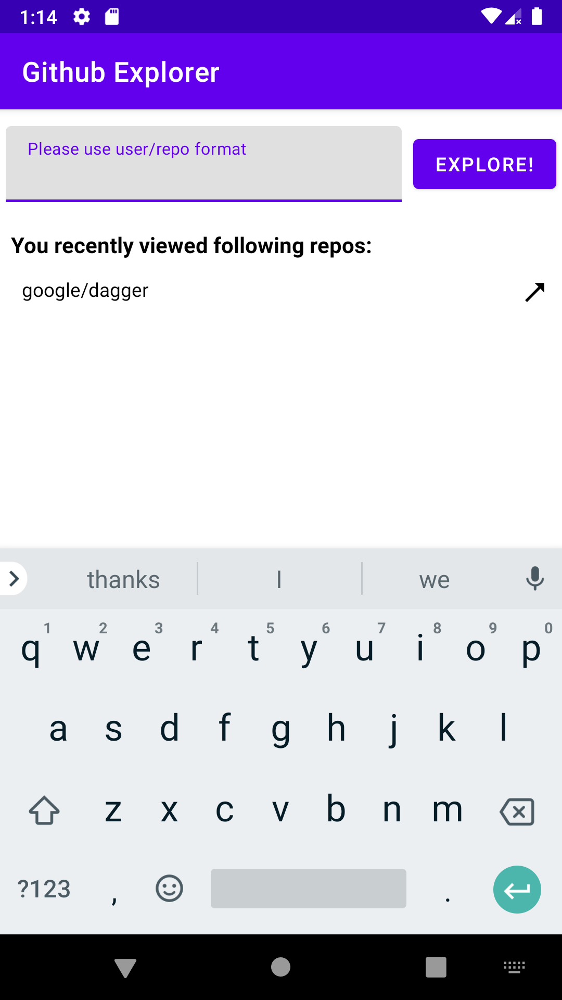

# GitHub Explorer

GitHub Explorer is a simple Android application for browsing commits inside github repositories.

## Installation

Use the terminal/cmd and run following commands:

```bash
./gradlew clean assemble
adb install -r app/build/outputs/apk/debug/app-debug.apk
```
or using the easy way, open project using Android Studio, press build and run.

## Usage
Type your repo data using input and press button. If repository exist, app'll redirect you to commit list.
